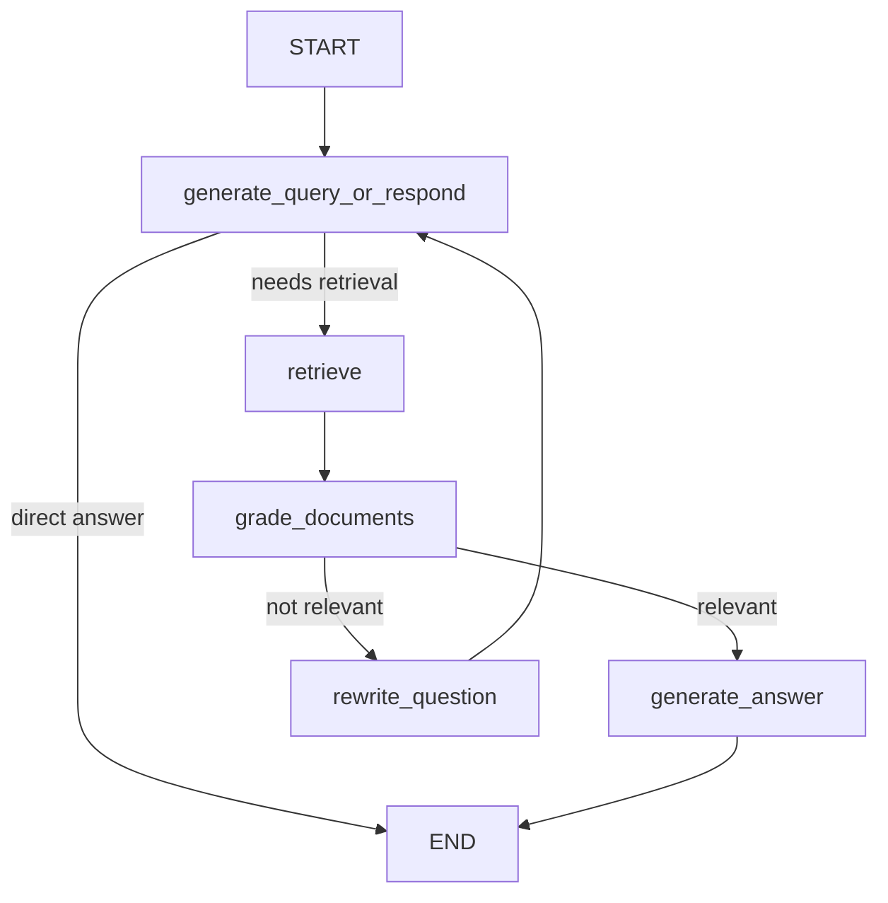

# Aprendizaje: agentic-rag.ipynb

## 📋 Resumen

**Notebook:** agentic-rag.ipynb (385KB adaptado)
**Tema:** Agentic RAG - RAG con flujo de decisiones inteligentes
**Estado:** ✅ Adaptado y funcional
**Fecha:** 2025-11-07

### 🎯 Objetivo
Aprender **Agentic RAG** - un sistema RAG que toma decisiones inteligentes sobre cuándo recuperar documentos, cómo evaluar su relevancia, y cuándo reformular preguntas para mejorar los resultados.

---

## 🔧 Adaptaciones Realizadas

### 1. Imports actualizados (LangChain 1.0+)
```python
# ❌ ANTES (deprecado)
from langchain.document_loaders import PyPDFLoader
from langchain.text_splitter import RecursiveCharacterTextSplitter
from langchain_openai import OpenAIEmbeddings
from langchain.chat_models import init_chat_model

# ✅ DESPUÉS (LangChain 1.0+)
from langchain_community.document_loaders import PyPDFLoader
from langchain_text_splitters import RecursiveCharacterTextSplitter
from langchain_huggingface import HuggingFaceEmbeddings
from langchain_groq import ChatGroq
```

### 2. LLM (OpenAI → Groq)
```python
# ❌ ANTES
llm_model = "openai:"+os.getenv("OPENAI_MODEL")
response_model = init_chat_model(llm_model, temperature=0)

# ✅ DESPUÉS
llm_model = os.getenv("OPENAI_MODEL")  # llama-3.1-8b-instant
response_model = ChatGroq(model=llm_model, temperature=0)
```

### 3. Embeddings (OpenAI → HuggingFace)
```python
# ❌ ANTES
vectorstore = InMemoryVectorStore.from_documents(
    documents=doc_splits, embedding=OpenAIEmbeddings()
)

# ✅ DESPUÉS
embeddings = HuggingFaceEmbeddings(model_name="all-MiniLM-L6-v2")
vectorstore = InMemoryVectorStore.from_documents(
    documents=doc_splits, embedding=embeddings
)
```

### 4. Dependencias instaladas
```bash
# Ya instaladas en .venv:
pip install pypdf langgraph langchain-huggingface langchain-groq
```

---

## 📚 Conceptos Clave

### 1. **Agentic RAG vs RAG tradicional**

| Aspecto | RAG Tradicional | Agentic RAG |
|---------|----------------|-------------|
| Flujo | Lineal: Query → Retrieve → Generate | Dinámico con decisiones |
| Decisiones | Ninguna | Múltiples nodos de decisión |
| Calidad | Dependiente de la query inicial | Auto-mejora con re-evaluación |
| Flexibilidad | Limitada | Alta (puede saltar retrieval) |

### 2. **Componentes del Flujo Agentic RAG**

#### A. **Query Generation Node**
Decide si la pregunta necesita búsqueda en documentos o puede responderse directamente:
```python
def generate_query_or_respond(state: MessagesState):
    response = response_model.bind_tools([retriever_tool]).invoke(state["messages"])
    return {"messages": [response]}
```
- Si la pregunta es simple ("hello!"), responde directamente
- Si necesita contexto, invoca la herramienta de retrieval

#### B. **Document Grading Node**
Evalúa si los documentos recuperados son relevantes:
```python
class GradeDocuments(BaseModel):
    binary_score: str = Field(description="'yes' or 'no'")

def grade_documents(state: MessagesState):
    # Usa LLM para determinar relevancia
    score = grader_model.with_structured_output(GradeDocuments).invoke(...)
    if score == "yes":
        return "generate_answer"
    else:
        return "rewrite_question"
```

#### C. **Question Rewriting Node**
Si los documentos no son relevantes, reformula la pregunta:
```python
def rewrite_question(state: MessagesState):
    question = messages[0].content
    prompt = REWRITE_PROMPT.format(question=question)
    response = response_model.invoke([{"role": "user", "content": prompt}])
    return {"messages": [{"role": "user", "content": response.content}]}
```

#### D. **Answer Generation Node**
Genera la respuesta final usando el contexto:
```python
def generate_answer(state: MessagesState):
    question = state["messages"][0].content
    context = state["messages"][-1].content
    prompt = GENERATE_PROMPT.format(question=question, context=context)
    response = response_model.invoke([{"role": "user", "content": prompt}])
    return {"messages": [response]}
```

### 3. **LangGraph Workflow**



**Componentes clave:**
- **Nodes**: Funciones que procesan el estado
- **Edges**: Conexiones entre nodos (condicionales o fijas)
- **State**: `MessagesState` compartido entre todos los nodos
- **Conditional Edges**: Toman decisiones basadas en output del nodo

---

## 📝 Estructura del Notebook

### Celdas 1-4: Setup e Imports
- Configuración de entorno y dependencias

### Celdas 5-13: Ingesta de Documentos
- Carga del PDF sobre cambio climático
- Split en chunks de 1000 caracteres
- Creación de vectorstore con embeddings locales

### Celdas 14-18: Retriever Tool
- Configuración de herramienta de búsqueda
- Test básico de retrieval

### Celdas 19-21: Node 1 - Query Generation
- Decisión: ¿Buscar en docs o responder directo?
- Tests con diferentes tipos de queries

### Celdas 22-27: Node 2 - Document Grading
- Evaluación de relevancia con LLM
- Tests con contextos relevantes e irrelevantes

### Celdas 28-31: Node 3 - Question Rewriting
- Reformulación de preguntas poco claras
- Tests de mejora semántica

### Celdas 32-34: Node 4 - Answer Generation
- Generación de respuesta con contexto
- Formato conciso (máx 3 oraciones)

### Celdas 35-43: Graph Assembly & Execution
- Construcción del workflow completo
- Visualización del grafo con Mermaid
- Ejecución con streaming de resultados

### Celdas 44-45: Follow-up
- Sugerencias de mejoras (hallucination check, web search)
- Link a Adaptive RAG tutorial

---

## 🎓 Aprendizajes Clave

### 1. Ventajas de Agentic RAG

✅ **Auto-corrección**: Si los docs no son relevantes, reescribe la query
✅ **Eficiencia**: Puede responder sin retrieval si no es necesario
✅ **Mejor calidad**: Evaluación de relevancia antes de generar respuesta
✅ **Transparencia**: Puedes ver cada paso del proceso (streaming)

### 2. Cuándo usar Agentic RAG

- ✅ Queries ambiguas o mal formuladas
- ✅ Corpus documental grande y diverso
- ✅ Necesitas trazabilidad del proceso de decisión
- ✅ Calidad > Velocidad
- ❌ Latencia crítica (más lento que RAG tradicional)
- ❌ Queries muy específicas y bien formuladas

### 3. Diferencias con react-web-search.ipynb

| Aspecto | react-web-search | agentic-rag |
|---------|-----------------|-------------|
| Fuente de datos | Web (Tavily API) | Documentos locales |
| Herramientas | Web search | Retriever vectorstore |
| Uso | Info actualizada | Corpus propio |
| Complejidad | Media | Alta |

### 4. InMemoryVectorStore vs Chroma

- **InMemoryVectorStore**: Simple, rápido, no persiste
- **Chroma**: Persistente, más features, ideal para producción
- Para aprendizaje: InMemoryVectorStore es suficiente

---

## 🔍 Ejemplo de Flujo Completo

**Input:** "what are the main reasons for climate change?"

**Paso 1 - Generate Query:**
```
Decisión: Necesita retrieval → Invoca retriever_tool
```

**Paso 2 - Retrieve:**
```
Retorna 4 chunks relevantes sobre causas del cambio climático
```

**Paso 3 - Grade Documents:**
```
Evaluación: Documentos contienen keywords relevantes
Score: "yes" → Procede a generate_answer
```

**Paso 4 - Generate Answer:**
```
"The main reasons for climate change include the increase in
greenhouse gases, such as carbon dioxide and methane, primarily
due to human activities like burning fossil fuels and deforestation."
```

---

## ✅ Checklist

- [x] Imports actualizados a LangChain 1.0+
- [x] LLM migrado a Groq (llama-3.1-8b-instant)
- [x] Embeddings migrados a HuggingFace (all-MiniLM-L6-v2)
- [x] Dependencias instaladas (pypdf, langgraph)
- [x] PDF de ejemplo disponible (Understanding_Climate_Change.pdf)
- [x] Tests de cada nodo funcionando
- [x] Graph assembly correcto
- [x] Documentación creada

---

## 🎯 Próximos Pasos

1. **Experimentar con el notebook:**
   - Probar diferentes queries
   - Ver el streaming en acción
   - Modificar los prompts de grading/rewriting

2. **Mejoras sugeridas:**
   - Agregar hallucination check (validar si la respuesta está basada en el contexto)
   - Integrar web search como fuente adicional (Adaptive RAG)
   - Agregar logging para debugging

3. **Siguiente notebook:**
   - `sql-agent.ipynb` - Agentes que interactúan con bases de datos SQL

---

## 📖 Referencias

- **Adaptive RAG Tutorial:** https://langchain-ai.github.io/langgraph/tutorials/rag/langgraph_adaptive_rag/
- **LangGraph Docs:** https://langchain-ai.github.io/langgraph/
- **Agentic RAG Paper:** CRAG (Corrective RAG)

---

**Progreso:** 5/8 notebooks (62.5%)
**Prerequisitos completados:** ✅ raglangchain.ipynb, ✅ react-web-search.ipynb
